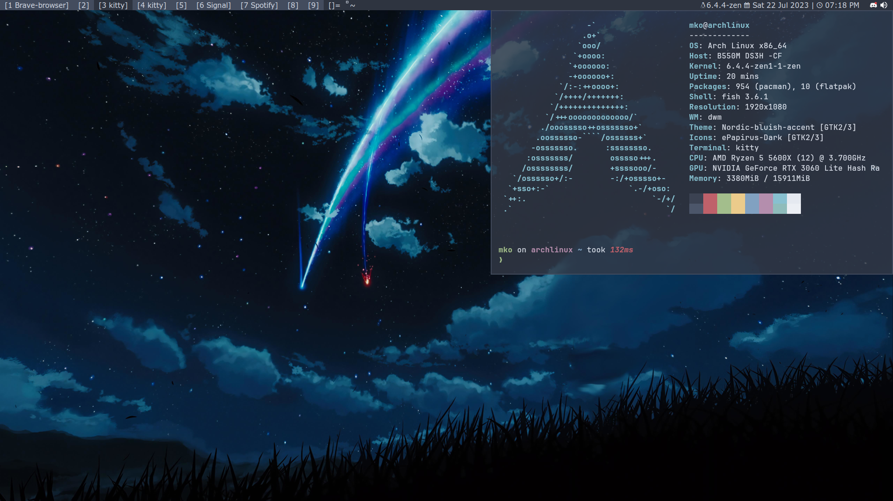

# dwm-mko

My Heavily Patched DWM Configuration built with [dwm-flexipatch](https://github.com/bakkeby/dwm-flexipatch)



TODO:
- Automatic Install Script
- Add Fedora Guide
- Add some keybinds
- Add window rules

## Manual Install instructions (Debian)

(I have a script titled `bar` in the `scripts` directory, if you want to change the script and where it's executed from, check `autostart.sh`)

### Dependencies

```bash
sudo apt install picom volumeicon-alsa feh dunst pcmanfm alacritty suckless-tools make gcc libx11-dev libxft-dev libxinerama-dev xorg
```
Or with [nala](https://github.com/volitank/nala)

```bash
sudo nala install picom volumeicon-alsa feh dunst pcmanfm kitty suckless-tools make gcc libx11-dev libxft-dev libxinerama-dev xorg
```

### Compiling 

```bash
git clone https://github.com/gitmko/dwm-mko ~/.dwm && cd .dwm
sudo make clean install
```

## Manual Install instructions (Arch)

(I have a script titled `bar` in the `scripts` directory, if you want to change the script and where it's executed from, check `autostart.sh`)

### Dependencies

```bash
sudo pacman -Syyu picom volumeicon dunst feh pcmanmfm alacritty dmenu xorg-xinit xorg
sudo pacman -S --needed build-essentials
```
### Compiling

```bash
git clone https://github.com/gitmko/dwm-mko ~/.dwm && cd .dwm
sudo make clean install
```
