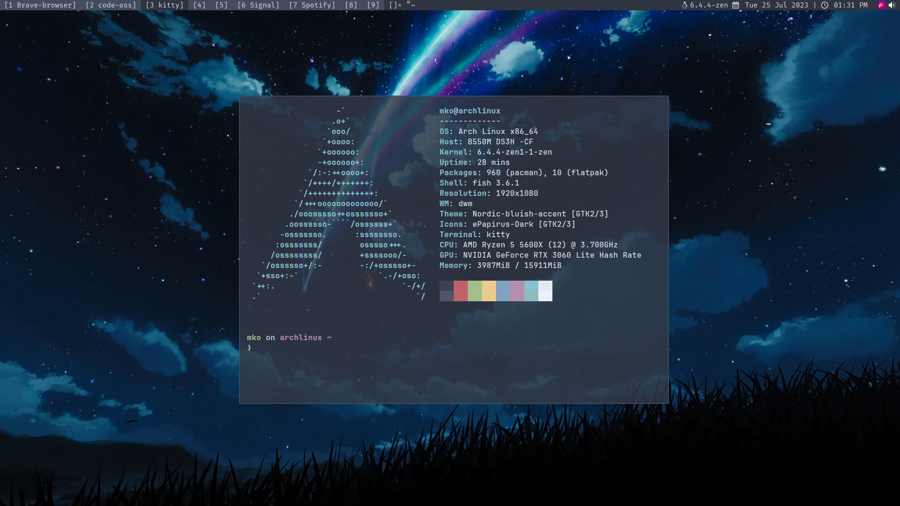

# dwm-mko

My Heavily Patched DWM Configuration built with [dwm-flexipatch](https://github.com/bakkeby/dwm-flexipatch)



TODO:
~~- Automatic Install Script~~
  - Arch ✅
  - Debian ✅
  - Fedora ✅
~~- Add Fedora Guide~~
~~- Add some keybinds~~
- Add window rules

## Automatic Installation

(script requires `sudo` for some commands, read into it if you want)

```bash
git clone https://github.com/gitmko/dwm-mko $HOME/.dwm
cd $HOME/.dwm
sudo ./install
```

## Manual Install instructions (Debian)

### Dependencies

```bash
sudo apt install flameshot policykit-1-gnome lxappearance picom volumeicon-alsa feh dunst pcmanfm alacritty suckless-tools make gcc libx11-dev libxft-dev libxinerama-dev xorg zip unzip fonts-roboto -y
```

Or with [nala](https://github.com/volitank/nala)

```bash
sudo nala install flameshot lxappearance picom volumeicon-alsa feh dunst pcmanfm alacritty suckless-tools make gcc libx11-dev libxft-dev libxinerama-dev xorg zip unzip fonts-roboto -y
```

### Compiling 

```bash
git clone https://github.com/gitmko/dwm-mko ~/.dwm && cd .dwm
sudo make clean install
```

#### Fonts

```bash
cd $HOME/.dwm/scripts/
bash fonts
```

#### Nordic GTK Theme

```bash
cd $HOME/.dwm/scripts/
bash gtk-theme
```

#### Nordzy-Cursors

```bash
cd $HOME/.dwm/scripts/
bash cursor
```

## Manual Install instructions (Arch)

### Dependencies

```bash
sudo pacman -Syyu flameshot polkit-gnome lxappearance wget picom volumeicon dunst feh pcmanfm alacritty dmenu xorg-xinit xorg ttf-roboto --noconfirm
```
### Compiling

```bash
git clone https://github.com/gitmko/dwm-mko ~/.dwm && cd .dwm
sudo make clean install
```

#### Fonts

```bash
cd $HOME/.dwm/scripts/
bash fonts
```

#### Nordic GTK Theme

```bash
cd $HOME/.dwm/scripts/
bash gtk-theme
```

#### Nordzy-Cursors

```bash
cd $HOME/.dwm/scripts/
bash cursor
```

## Manual Install instructions (Fedora)

### Dependencies

```bash
dnf install picom lxappearance polkit-gnome volumeicon feh dunst pcmanfm alacritty dmenu rofi make gcc libX11-devel libXft-devel libXinerama-devel libXrandr-devel xorg-x11-xinit-session unzip zip google-roboto-fonts flameshot -y
```
### Compiling

```bash
git clone https://github.com/gitmko/dwm-mko ~/.dwm && cd .dwm
sudo make clean install
```

#### Fonts

```bash
cd $HOME/.dwm/scripts/
bash fonts
```

#### Nordic GTK Theme

```bash
cd $HOME/.dwm/scripts/
bash gtk-theme
```

#### Nordzy-Cursors

```bash
cd $HOME/.dwm/scripts/
bash cursor
```